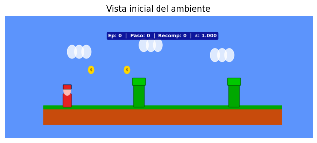
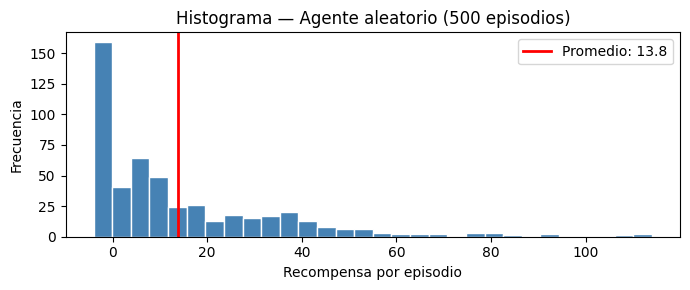
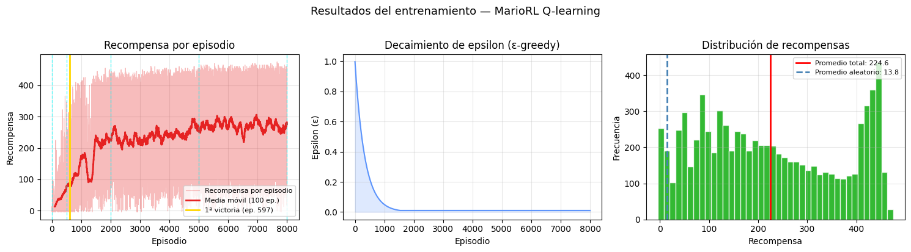

<div align="center">

<h1>🍄 MarioRL — Q-learning</h1>

<p>
  
  
  
  
</p>

<p align="center">
  <a href="https://colab.research.google.com/github/douglasbarbosaoliveira/marioRL-Q-learning
/blob/main/MarioRL-Q-Learning.ipynb" target="_blank">
    
  </a>
</p>



</div>

---

## 🎬 Demo

https://github.com/douglasbarbosaoliveira/mariorl-q-learning/blob/main/MarioRL-Q-learning.mp4

---

<h2 id="español">🇲🇽 Español</h2>

### ¿Qué es este proyecto?

Un agente de **Q-learning** que aprende a jugar un mini-juego estilo **Mario Bros** desde cero, usando aprendizaje por refuerzo. El agente empieza sin saber nada y, a base de prueba y error, aprende a saltar obstáculos y recolectar monedas hasta lograr sobrevivir **300 pasos seguidos**.

El notebook incluye explicaciones detalladas de cada paso, código comentado en español y un video evolutivo que muestra la progresión del agente a lo largo del entrenamiento.

### 🧠 Conceptos implementados

| Concepto | Descripción |
|---|---|
| **Q-learning** | Algoritmo de aprendizaje por refuerzo basado en tabla de valores |
| **ε-greedy** | Estrategia que balancea exploración vs. explotación |
| **Q-table** | Tabla `9×3×5×9×2 = 2,430` valores que representan la política del agente |
| **Discretización** | Conversión del espacio de estados continuo a índices discretos |

### 🎮 ¿Cómo funciona el juego?

- Mario avanza automáticamente y el agente decide **cuándo saltar**
- Los obstáculos (tubos) y monedas se acercan desde la derecha
- **Recompensas:** +1 por sobrevivir, +5 por moneda, −10 por chocar
- **Victoria:** sobrevivir 300 pasos seguidos sin chocar

### 📈 Resultados del entrenamiento



> El agente aleatorio obtiene un promedio de **13.8** de recompensa por episodio.



> Después del entrenamiento, el agente alcanza un promedio de **224.6** — más de **16× mejor** que el agente aleatorio. La primera victoria ocurrió en el **episodio 597**.

### 📁 Estructura del repositorio

```
mariorl-q-learning/
├── images/
│   ├── vistainicial.png           # Vista inicial del ambiente
│   ├── agentealeatorio.png        # Histograma del agente aleatorio
│   └── resultadosentrenamiento.png # Gráficas del entrenamiento
├── MarioRL-Q-learning.ipynb       # Notebook principal — reporte y tutorial
├── index.html                     # Versión HTML del notebook
├── MarioRL-Q-learning.mp4         # Video evolutivo del entrenamiento
└── README.md                      # Este archivo
```

### ▶️ Cómo ejecutar

1. Abre el notebook en Google Colab:

   [](https://colab.research.google.com/)

2. Ejecuta las celdas en orden con `Shift+Enter`
3. Al finalizar se genera automáticamente el video evolutivo

### 📦 Dependencias

```
pyvirtualdisplay · imageio · imageio-ffmpeg · matplotlib · numpy
```

### 📊 Métricas finales

| Métrica | Valor |
|---|---|
| Episodios de entrenamiento | 8,000 |
| Primera victoria | episodio 597 |
| Valores en Q-table | 2,430 |
| Promedio agente aleatorio | 13.8 |
| Promedio agente entrenado | 224.6 |
| Mejora | ~16× |

---

<h2 id="english">🇺🇸 English</h2>

### What is this project?

A **Q-learning** agent that learns to play a **Mario Bros**-style mini-game from scratch using reinforcement learning. The agent starts with zero knowledge and, through trial and error, learns to jump over obstacles and collect coins until it can survive **300 consecutive steps**.

The notebook includes detailed explanations of each step, code commented in Spanish, and an evolution video showing the agent's progression throughout training.

### 🧠 Implemented concepts

| Concept | Description |
|---|---|
| **Q-learning** | Value-based reinforcement learning algorithm |
| **ε-greedy** | Strategy balancing exploration vs. exploitation |
| **Q-table** | `9×3×5×9×2 = 2,430` values representing the agent's policy |
| **Discretization** | Converting continuous state space into discrete indices |

### 🎮 How the game works

- Mario moves forward automatically and the agent decides **when to jump**
- Obstacles (pipes) and coins approach from the right
- **Rewards:** +1 for surviving, +5 per coin, −10 for hitting an obstacle
- **Win condition:** survive 300 consecutive steps without crashing

### 📈 Training results


> The random agent achieves an average reward of **13.8** per episode.


> After training, the agent reaches an average of **224.6** — more than **16× better** than the random agent. The first win occurred at **episode 597**.

### 📁 Repository structure

```
mariorl-q-learning/
├── images/
│   ├── vistainicial.png            # Initial environment view
│   ├── agentealeatorio.png         # Random agent histogram
│   └── resultadosentrenamiento.png # Training charts
├── MarioRL-Q-learning.ipynb        # Main notebook — full report and tutorial
├── index.html                      # HTML version of the notebook
├── MarioRL-Q-learning.mp4          # Training evolution video
└── README.md                       # This file
```

### ▶️ How to run

1. Open the notebook in Google Colab:

   [](https://colab.research.google.com/)

2. Run cells in order with `Shift+Enter`
3. The evolution video is generated automatically at the end

### 📦 Dependencies

```
pyvirtualdisplay · imageio · imageio-ffmpeg · matplotlib · numpy
```

### 📊 Final metrics

| Metric | Value |
|---|---|
| Training episodes | 8,000 |
| First win | episode 597 |
| Q-table values | 2,430 |
| Random agent average | 13.8 |
| Trained agent average | 224.6 |
| Improvement | ~16× |

---

<h2 id="português">🇧🇷 Português</h2>

### O que é este projeto?

Um agente de **Q-learning** que aprende a jogar um mini-jogo estilo **Mario Bros** do zero, usando aprendizado por reforço. O agente começa sem saber nada e, através de tentativa e erro, aprende a pular obstáculos e coletar moedas até conseguir sobreviver **300 passos consecutivos**.

O notebook inclui explicações detalhadas de cada etapa, código comentado em espanhol e um vídeo evolutivo mostrando a progressão do agente ao longo do treinamento.

### 🧠 Conceitos implementados

| Conceito | Descrição |
|---|---|
| **Q-learning** | Algoritmo de aprendizado por reforço baseado em tabela de valores |
| **ε-greedy** | Estratégia que equilibra exploração vs. exploração |
| **Q-table** | Tabela `9×3×5×9×2 = 2.430` valores representando a política do agente |
| **Discretização** | Conversão do espaço de estados contínuo em índices discretos |

### 🎮 Como o jogo funciona

- Mario avança automaticamente e o agente decide **quando pular**
- Obstáculos (tubos) e moedas se aproximam pela direita
- **Recompensas:** +1 por sobreviver, +5 por moeda, −10 por colidir
- **Vitória:** sobreviver 300 passos consecutivos sem colidir

### 📈 Resultados do treinamento


> O agente aleatório obtém uma recompensa média de **13,8** por episódio.


> Após o treinamento, o agente alcança uma média de **224,6** — mais de **16× melhor** que o agente aleatório. A primeira vitória ocorreu no **episódio 597**.

### 📁 Estrutura do repositório

```
mariorl-q-learning/
├── images/
│   ├── vistainicial.png             # Vista inicial do ambiente
│   ├── agentealeatorio.png          # Histograma do agente aleatório
│   └── resultadosentrenamiento.png  # Gráficos do treinamento
├── MarioRL-Q-learning.ipynb         # Notebook principal — relatório e tutorial
├── index.html                       # Versão HTML do notebook
├── MarioRL-Q-learning.mp4           # Vídeo evolutivo do treinamento
└── README.md                        # Este arquivo
```

### ▶️ Como executar

1. Abra o notebook no Google Colab:

   [](https://colab.research.google.com/)

2. Execute as células em ordem com `Shift+Enter`
3. O vídeo evolutivo é gerado automaticamente no final

### 📦 Dependências

```
pyvirtualdisplay · imageio · imageio-ffmpeg · matplotlib · numpy
```

### 📊 Métricas finais

| Métrica | Valor |
|---|---|
| Episódios de treinamento | 8.000 |
| Primeira vitória | episódio 597 |
| Valores na Q-table | 2.430 |
| Média agente aleatório | 13,8 |
| Média agente treinado | 224,6 |
| Melhora | ~16× |

---

<div align="center">

**Douglas Barbosa de Oliveira**

**Universidad de Monterrey (UDEM) · Inteligencia Artificial I**

</div>
